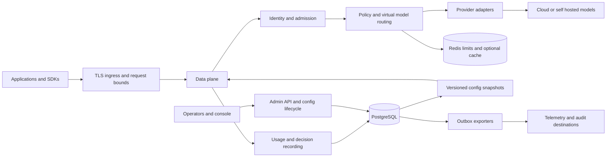

# AI Inference Gateway architecture

Updated 2026-09-21. Sections explicitly marked **current** describe implemented Phase 6 code. All other sections describe the **target design**, to be implemented through [Phases.md](Phases.md). [Phase6.md](Phase6.md) records verification and open gates. [PRD.md](PRD.md) owns product scope; [API.md](API.md), [Security.md](Security.md), and [Operations.md](Operations.md) expand the contracts.

The product owner authorizes revising existing architecture and implementation when correctness, maintainability, sound design or future complexity warrants it. Decisions below are current design choices, not immutable constraints. Document significant replacements and their evidence using [Development.md](Development.md); keep dependent contracts, migrations and release gates aligned.

## 1. Current implementation and gaps

The current application is a Java 21 / Spring Boot 4.1.1 modular backend using Spring MVC, JPA, Flyway and PostgreSQL, with a Tomcat 11.0.25 security patch override. Its Ollama adapter uses a shared Apache HttpClient 5 transport and Jackson 3 with `/api/generate`, streaming disabled. Redis 7 remains an unused Compose service. PostgreSQL 16 is the local database image. Maven 3.9.11 is checksum-pinned through the wrapper; image base manifests and CI actions are pinned. These choices establish a tested foundation, not production qualification.

Current request flow: `RequestIdFilter → AdmissionFilter → ApiKeyFilter → InferenceController → InferenceService → RoutingEngine → OllamaProvider → ProviderTransport`, followed by one best-effort terminal `RequestLogService` call. Admission bounds body bytes and concurrent work before BCrypt; the request deadline includes admission/authentication time before upstream dispatch. IDs are assigned before authentication and returned in `X-Request-Id`. Inference/error bodies contain an ID; the providers array and pagination envelope do not universally contain a top-level ID.

| Area | Evidence in current code | Required change |
|---|---|---|
| Authentication | `ApiKeyService` scans all active BCrypt hashes; filter creates generic `api-key-user` | Indexed key lookup, immutable principal, tenant/scopes, lifecycle |
| Authorization | Any valid key can query global providers/logs | Tenant-scoped queries and separate admin roles before shared use |
| Routing/config | Registry builds adapters at startup; routing/model validation also query DB per request | Consistent immutable config snapshots; explicit refresh/versioning |
| Provider abstraction | `AIProvider.infer/info/health`; registry has an Ollama switch | Capability-aware operations and adapter factories; abstraction changes are expected |
| Timeouts/errors | Explicit connect/read/pool timeouts, deadline cancellation, safe fixed error messages; no retry/redirect | Streaming cancellation and per-deployment pool isolation in Phases 7/9 |
| Logging | Routing and unexpected failures tracked; diagnostic save failure cannot replace original outcome | Durable usage/audit/outbox remains later work; diagnostic writes are synchronous and best effort |
| Privacy | No content in diagnostic records; provider exception text/bodies excluded from gateway error logs | Complete privacy/export/retention and dependency-log review in Phase 11 |
| Validation | Parser, query, media and body limits enforced; 400/413/415 mapped explicitly | New protocol feature/capability validation in Phase 7 |
| Database | V6 deactivates seed credential; nonlocal startup rejects active demo credentials; V1–V5 unchanged | Tenant identifiers, event identities, scoped data migration in Phase 8 |
| Testing | Fast H2 suite plus real PostgreSQL fresh/upgrade/startup tests and controllable HTTP upstream | Redis, multi-replica and SDK tests as those features arrive |
| Operations | Explicit local bootstrap; production default; private management with minimal health; non-root image; CI verification/scans | Remote CI evidence, deployment packages, HA/recovery and qualification in Phase 13 |

Existing packages are `api`, `auth`, `routing`, `provider`, `inference`, `logging`, `config`, `error`, and `common` under `src/main/java/com/gateway`. Existing tables are `providers`, `models`, `api_keys`, and `request_logs`. Reuse components that fit the product and refactor or replace those that do not; there is no requirement to preserve the existing structure or restructure every file first.

## 2. Architectural decisions

| ID | Decision | Reason and reconsideration trigger |
|---|---|---|
| A01 | One deployable modular monolith first | Fast delivery and simple operation. Split control/data processes only after measured contention, independent scaling, or isolation needs |
| A02 | Retain Java 21, MVC, Spring Security, JPA and Flyway; upgrade to Boot 4.1.1 and Jackson 3 in Phase 6 | Tests and real PostgreSQL startup validate the upgrade; no Jackson compatibility layer. Reassess if measured streaming needs warrant a different edge |
| A03 | Start with MVC asynchronous SSE and a cancellable streaming HTTP transport | Avoid a mandatory whole-stack rewrite. Phase 7 compares bounded MVC streaming with a reactive edge under slow-client load; choose based on evidence |
| A04 | PostgreSQL owns config, identities, audit, metering and hard-budget reservations; Redis handles fast ephemeral state | Durable correctness stays recoverable. Redis loss must not reset authoritative spending |
| A05 | Typed declarative policy and immutable snapshots | Deterministic evaluation, simulation and rollback; no arbitrary scripts on request threads. CEL/OPA is an optional later adapter |
| A06 | Generic HTTP protocol adapters plus provider-specific translation at the edge | Reuse compatible providers without pretending their features are identical; narrow SDK use is allowed for signing/identity |
| A07 | Metadata-only observability; exact caching opt-in | Preserve privacy while adding useful diagnosis; semantic cache requires a later quality/privacy design |
| A08 | Durable outbox and bounded exporters before a broker | No mandatory Kafka. Add a broker only when throughput, consumer isolation or delivery needs exceed measured PostgreSQL capacity |
| A09 | Single-region HA first; equivalent policy semantics across deployment packages | Avoid global budget/consistency promises before a regional system is proven |
| A10 | Phase 6 uses Apache HttpClient 5 behind `ProviderTransport`, shared strict pool, explicit abort and no retries | Replaces implicit RestClient lifecycle with testable bounds. Keep native wire encoding in OllamaProvider; revisit transport in A03 and isolate deployments in Phase 9 |

### Current Phase 6 bounds

Defaults: 1 MiB request body; 262,144 prompt characters; 200-character model/provider names; 64 admitted `/v1/` requests; 100 servlet threads; 32 total / 8 per-route upstream connections; 250 ms pool acquisition; 2 s connect; 30 s response/idle-read; 120 s admission-to-upstream deadline; 2 MiB upstream body. HTTP retries and redirects are disabled. Oversized input returns 413 and saturation 503. Low-cardinality admission/outcome/latency metrics exclude client-supplied identifiers.

The upstream deadline actively cancels the socket, including a trickling response. Incoming body reads check the deadline between reads and use Tomcat's 5 s connection/read idle bound. Authentication and synchronous diagnostics use separately bounded database operations (2 s pool/query, 5 s socket/transaction); the deadline is **not** a hard bound on all servlet processing or response delivery. A downstream disconnect does not yet cancel non-streaming generation immediately. Phase 7 owns async context, stream backpressure and disconnect propagation. The shared pool does not yet provide deployment bulkheads.

Spring documents SSE and reactive-client integration in MVC, while response writes remain blocking. This makes executor sizing and slow-client tests mandatory for A03. The final transport decision must use documentation for the chosen Spring version. [Spring asynchronous requests](https://docs.spring.io/spring-framework/reference/web/webmvc/mvc-ann-async.html)

## 3. Target topology and module boundaries

Data and control planes are boundaries inside one application initially. The inference path consumes published snapshots; it never calls the admin API. The console has no direct database access.

| Module | Responsibility | Boundary |
|---|---|---|
| `protocol` / existing `api` | Legacy, Chat Completions, embeddings and later native protocol mapping | No provider credentials or repository orchestration in controllers |
| `identity` / existing `auth` | Credentials, principal resolution, scopes and tenant context | Downstream code consumes authenticated context, not untrusted identity headers |
| `inference` | Lifecycle, deadline, cancellation, admission and finalization | No provider-specific wire DTOs |
| `policy` | Permissions, residency, privacy, limits, guardrail and route decisions | Pure evaluation over typed input and pinned snapshot |
| `routing` | Eligible candidates, pools, health, attempts and fallback | All attempts honor the same security constraints |
| `provider` | Adapter factories, capability descriptors, transport and error translation | Credentials resolved just in time; isolated connection pools |
| `governance` | Request/token quotas, reservations, normalized usage and pricing | Atomic admission; recoverable settlement |
| `telemetry` / existing `logging` | Request summaries, attempt events, metrics and spans | Bounded queues, no implicit content logging |
| `control` / existing `config` | Admin services, revisions, publication, simulation and audit | Transactional mutation plus audit/outbox |
| `cache`, `guardrail` | Optional response reuse and explicit content policy | Tenant-aware; policy governs external destinations |
| `operations` | Readiness, draining, reconciliation and export workers | Lifecycle and bounded recovery jobs |

These are ownership boundaries, not a prescribed directory migration or a requirement to create empty packages. Use ordinary module tests; introduce build modules only when isolation helps.

## 4. Execution contracts and request lifecycle

### Internal contracts

Define immutable domain records before changing adapters:

- `GatewayContext`: server request ID, trace context, tenant/application/service-account/key IDs, granted scopes, config revision, receipt time, absolute deadline and cancellation handle. No raw credential or content in `toString`.
- `InferenceCommand`: operation, client model alias, typed messages/content or embedding inputs, generation options, tool declarations, response constraints, stream flag and allowlisted metadata.
- `DeploymentCapabilities`: supported operations, streaming, modalities, tools, structured output, usage reporting, context/output bounds and API version. Capabilities belong to deployment/model combinations, not only provider brands.
- `InferenceResult`: typed output, finish reason, normalized usage, upstream correlation ID, deployment ID and safe extensions.
- `StreamEvent`: start, text/content delta, tool delta, usage, finish, or error; ordered sequence within one attempt. Terminal completion is exclusive and idempotent.
- `ProviderFailure`: category, safe message, upstream status, retry-after, dispatch certainty, usage certainty and retry eligibility. Raw upstream bodies are excluded from public errors.
- `DecisionRecord`: revision/rule IDs, eligible/rejected deployment IDs with safe reasons, selection strategy, attempt outcomes, limit/guardrail results and final status.

Evolve `AIProvider` into an internal v2 SPI with separate execute and stream operations, capabilities and probes. The stream contract must expose cancellation and bounded consumption; choose its Java type during A03's spike. Do not freeze a public SDK/SPI before adapter conformance stabilizes. Preserve the legacy DTO facade while introducing these records.

### Target execution order

1. Assign request/trace correlation and enforce header/body/connection bounds before expensive authentication.
2. Authenticate; resolve immutable principal and scope. Pin a valid config snapshot. Reject stale security state.
3. Parse protocol into a typed command and validate operation, alias and requested features.
4. Evaluate access, residency and input guardrails; record matched rules. User metadata may inform explicitly allowed routing conditions, never establish identity.
5. Apply request and concurrency limits, then check an eligible exact-cache entry. Authorization and current output policy apply even to cache hits.
6. Resolve eligible deployments, excluding unsupported capabilities, forbidden regions, disabled targets and open circuits.
7. Reserve estimated tokens and the conservative cost of the next attempt. Record a durable attempt intent before paid dispatch. Do not hold a SQL transaction open during upstream generation.
8. Invoke provider with remaining deadline, bounded buffers and cancellation. Retry/fallback only under the matrix below; each attempt obtains its own cost reservation.
9. Apply output policy and encode the chosen wire protocol. Record whether response bytes have been committed.
10. Finalize on success, denial, failure, timeout or cancellation. Persist usage/decision outcome, settle or retain reservations, and publish export work through the outbox. Release concurrency permits idempotently.

A cache hit consumes request/concurrency policy, records gateway-served usage and zero upstream invocation cost, and does not consume an upstream token reservation. Separate served-token quotas may be configured. Failed authentication produces bounded security telemetry without inventing a tenant attribution.

## 5. Streaming and reliability

Maintain one absolute deadline across queueing, policy, retries and upstream reads. Separate connect, first-byte, idle-read and total timeouts are capped by remaining time. The target streaming policy starts with 2 seconds connect, 30 seconds first-byte, 15 seconds idle, and 120 seconds total; local slow models require explicit longer profiles. Phase 6 currently enforces 2 seconds connect, a combined 30-second response/idle-read timeout and a 120-second upstream deadline; distinct streaming first-byte/idle controls remain Phase 7 work.

Default automatic retry is off until Phase 9. Initial resilient policy permits at most three upstream attempts total, including fallbacks. Use jittered backoff and honor valid `Retry-After` only if the remaining deadline allows it. Disable hidden HTTP-client/SDK retries or charge them to the same budget.

| Failure or event | Action before downstream bytes | After downstream bytes |
|---|---|---|
| Invalid input, forbidden model/region, guardrail block | Terminal client/policy error; no fallback | Cancel and terminate if detected during output enforcement |
| Upstream credential failure | Disable/alert on affected deployment; no same-target retry; fallback only to separately authorized target by explicit policy | Terminate; no replay |
| Connect failure known before dispatch | Eligible for bounded retry/fallback | Terminate; no replay |
| Upstream 429 | Classify rate limit versus exhausted quota; honor cooldown; eligible alternatives still obey tenant limits | Terminate; no replay |
| Transient 502/503/504 or reset | Retry only if attempt semantics permit; uncertain dispatch means possible duplicate charge | Terminate; retain uncertain usage |
| Read timeout after upstream accepted request | No automatic retry by default; opt-in safe generation policy may accept duplicate computation/cost | Terminate; retain uncertain usage |
| Malformed response/stream | Mark provider failure; pre-output fallback only when safe and explicitly classified | Emit safe protocol error if possible, close |
| Client disconnect or total deadline | Cancel outstanding call; finalize once; no further attempt | Same |

For SSE, withhold downstream headers/body until a valid first event or a terminal pre-stream error where transport permits. Any downstream byte, including a heartbeat, closes the retry window. Partial tool arguments must never be represented as a completed tool call after failure. A stream error cannot replace an already-sent HTTP 200 status; document wire behavior in [API.md](API.md).

Bound decoded event size, per-stream buffered bytes, output size and write duration. A slow client must backpressure the upstream or trigger cancellation, never accumulate an unbounded queue. Disconnect detection is not instantaneous in Servlet APIs; use periodic safe heartbeat/write checks and idle timeouts, measuring cleanup from detection separately from detection latency. Carry context across async callbacks and clear it after completion.

Active probes assess reachability/model readiness without repeatedly generating billable text. Passive health tracks real attempts. Circuit breakers are per deployment locally; Redis may share cooldown hints but is not an authoritative global circuit. Use limited half-open probes and recovery jitter. Round-robin and least-latency policies follow priority/weighted pools once sample freshness and starvation controls are tested. Record the runtime health inputs needed for explainability; simulation cannot predict future availability or quality.

## 6. Identity and tenant isolation

Keys use a versioned format such as `gw_<public-id>_<random-secret>`. Look up one indexed public ID and verify only its secret hash. Never derive the new prefix from an existing BCrypt hash. Old keys require explicit rotation or a time-bounded legacy path; invalid new-format keys never fall back to an all-key scan.

Principals carry tenant, application, service account and scope. Separate inference keys from admin OIDC access tokens. Validate issuer, audience, signature, expiry and tenant membership. Minimal beta roles are platform administrator, tenant administrator, developer and auditor; detailed permissions are in [Security.md](Security.md).

Tenant-owned tables include non-null tenant IDs, composite tenant/resource constraints and tenant-scoped repository access. Add PostgreSQL row-level security as defense in depth using transaction-local tenant context and a non-owner runtime role; test pooling and worker context cleanup. Dedicated deployment is the initial option for customers requiring stronger isolation than shared tables.

Revocation and tenant suspension use a security epoch checked independently of a pinned routing snapshot. Healthy replicas should observe changes in 5 seconds; security state older than 30 seconds rejects new governed calls. Recheck before every fallback; emergency tenant/deployment disable can cancel in-flight work. Ordinary route publication does not alter an in-flight request.

## 7. Logical data model

Target entity names guide migrations; they are not tables already present.

| Entity | Essential fields and constraints |
|---|---|
| `tenants` | UUID, unique name/slug, status, security epoch, default privacy/residency policy |
| `applications`, `service_accounts` | Tenant ID, owner/application linkage, environment, status; tenant-safe foreign keys |
| `memberships`, `role_bindings` | Tenant, external issuer/subject or service-account ID, role, delegated resource scope and status; no cross-tenant grant by implicit inheritance |
| `gateway_keys` | Unique public ID, secret hash, tenant/application/principal, scopes, expiry, revoked time, rotation group, coarse last-used time |
| `providers` | Adapter type, ownership scope, approved endpoint and credential reference; evolves current provider config |
| `deployments` | Tenant, provider, upstream model, region, capabilities, connection profile and credential override reference |
| `virtual_models`, `route_policies` | Unique tenant/alias, operation set, revisioned candidate pools and constraints |
| `config_versions`, `config_activations` | Schema version, immutable payload/hash, author, parent revision, lifecycle and active revision per scope |
| `replica_config_status` | Replica, revision, activation acknowledgement, heartbeat, validation error |
| `request_events`, `attempt_events` | Tenant/request/attempt IDs, revision, route and outcome, timings; unique event identity; no default content |
| `usage_events` | Append-only event ID, attempt, token categories, usage source, price version, currency, amount, correction linkage |
| `price_versions` | Deployment/model, effective interval, explicit category rates and currency; never overwrite past rates |
| `budgets`, `budget_reservations` | Tenant/application/key scope, UTC period, limit, spent/reserved, attempt ID, state/lease; unique reservation |
| `audit_events`, `outbox_events` | Actor, action, scope, resource/revision hashes, event identity and timestamp; exporter state separate |
| Optional `content_objects` | Tenant, encrypted object reference, key reference, retention expiry and access policy; never inline unrestricted payloads |

Use UUIDs and UTC `timestamptz` for new event data. Use integer token counts and fixed-precision decimal money with currency and price version, never floating point. Reasoning and cached tokens may be subsets of provider totals; keep original category semantics to prevent double counting. Provider usage and local estimates are distinguishable.

Index tenant/time and request/attempt lookups. Introduce time partitions when measured retention/query volume justifies them. Use stable cursor pagination for new event APIs. Retention removes partitions/events through an authorized process; append-only does not mean legally or operationally undeletable. Audit integrity needs restricted roles and optional immutable external storage, not a claim that SQL alone is tamper-proof.

## 8. Limits and durable accounting

Redis atomic operations enforce request/token windows and bounded concurrency leases across replicas. All applicable tenant/application/key/model constraints are checked; a request cannot pass one scope while bypassing another. Document window boundaries, clock source, reservation release and maximum drift. Start with one region; partition keys consistently if later introducing Redis Cluster.

PostgreSQL transactions reserve hard-budget cost at every applicable scope using consistent lock order and an idempotent attempt ID. Reservation plus durable dispatch intent precedes upstream work. Record actual usage and settle reservations in one transaction; adjustments append correction events. Successful output does not imply provider billing certainty.

A crashed/expired worker does not prove a request was unbilled. Recovery marks the attempt uncertain, retains its reservation and reconciles from provider data or an audited conservative settlement policy. TTL may release concurrency leases, not erase financial liability. A price change cannot retroactively change a reservation's price version.

No distributed transaction spans PostgreSQL, Redis and a model provider. Partial admission failures release safe Redis reservations idempotently; outstanding database reservations are reconciled. Durable usage means recoverable intent and explicit uncertainty, not exactly-once generation. If a final write fails after streaming has started, stop further dispatch, retain the durable intent, record bounded recovery state and reconcile; do not claim a missing final row means zero cost.

## 9. Configuration lifecycle and policy simulation

One configuration version contains internally consistent aliases, deployments and policy references. The lifecycle is `draft → validated → staged → active → superseded`; validation failures never publish. Admin mutations use optimistic locking (`ETag/If-Match`) and idempotency keys. A publish transaction writes activation, audit and outbox together.

Workers validate and construct a new immutable snapshot, then atomically swap references. Notifications accelerate refresh; periodic polling catches missed messages. Pin old adapters while their requests drain, then close them. Reject unknown schema versions and invalid secret/capability references. Report activation as converging until replicas acknowledge; remove stale replicas from readiness after the security freshness bound.

Rollback activates a previously validated immutable revision through a new audited activation. It does not roll back schema migrations, revoke usage events, undo spending, or resurrect revoked credentials. Ordinary revision rollback cannot override the latest security epoch.

The simulator shares the evaluator, takes synthetic/redacted inputs, supplied time/health/counter snapshots and a deterministic random seed, and returns matched rules and candidate exclusions. It performs no external calls, budget mutation or side effects. Metadata-only replay cannot evaluate unseen prompt-dependent rules: report those checks as unevaluated. Never label a synthetic result a prediction of model quality.

## 10. Cache, guardrails and observability

Exact cache is off by default. Authorization precedes every lookup. Keys include tenant, application/access partition, operation, virtual model, effective deployment identity, model/config/prompt/guardrail revisions, normalized parameters and a tenant-keyed digest of inputs. Store content only in approved encrypted infrastructure with TTL, size bounds and purge controls. Arbitrary user IDs cannot expand cache sharing.

GA cache supports explicitly opted-in non-streaming text/embedding results with reproducible semantics. Bypass streams, tool calls, secrets, personalized requests without safe partitioning, and nondeterministic outputs unless policy explicitly allows reuse. Never cache errors or policy blocks. Reapply applicable output policy on hits.

Guardrail interfaces support pre-request, post-response and streaming checks with allow, audit, block and redact results. Mandatory security checks fail closed on timeout/unavailability; advisory checks may fail open only by policy and with a degraded event. Regex/secret detection is a bounded first implementation, not a guarantee of PII detection. External guardrails are data egress destinations subject to residency and credentials policy.

Whole-output checks require buffering within a configured cap before release or disabling streaming for that policy. Chunk checks cannot retract emitted text and can miss cross-boundary semantics; bounded look-behind supports specific detectors only. The capability/policy validator must reject combinations it cannot enforce.

Publish Micrometer/Prometheus counters/histograms and OpenTelemetry spans for admission, policy, attempts, cache and finalization. Record TTFT, total latency, upstream latency, overhead, token throughput, retries, fallbacks, cancellations, exporter lag and reservation age. Use low-cardinality labels; key/request IDs belong in authorized traces/events, not metric labels. Pin telemetry schema versions because GenAI conventions evolve. [OpenTelemetry GenAI conventions notice](https://opentelemetry.io/docs/specs/semconv/gen-ai/)

## 11. Dependency outages and operating behavior

| Dependency/event | Target behavior |
|---|---|
| PostgreSQL unavailable | Reject new governed admission and admin mutations with sanitized 503; do not restart solely for DB loss; in-flight outcomes may require reconciliation |
| Redis unavailable | Hard distributed limits fail closed with 503; explicitly best-effort routes may use conservative local caps and degraded telemetry; cache bypasses |
| Telemetry collector unavailable | Inference continues with bounded queues, dropped-diagnostic counters and durable outbox where required |
| Audit persistence unavailable | Reject admin mutation before activation; audit cannot be silently discarded |
| Required secret resolver unavailable | Use only an unexpired permitted cached credential, otherwise fail deployment admission; never reuse arbitrary stale secrets |
| Mandatory guardrail unavailable | Fail closed; advisory mode emits explicit degradation |
| All providers unavailable | Return bounded 503/504 with request ID; probes/recovery continue; avoid restart loops |
| Stale config/revocation view | Reject new governed traffic after freshness threshold; report unready |
| Rolling shutdown | Become unready, stop admission, drain/cancel within configured grace, finalize attempts and release leases |

Reference topology is two or more stateless replicas behind TLS ingress in one region, managed/operated HA PostgreSQL and Redis, optional object storage, and an external OIDC issuer. No sticky sessions are required for stateless inference; an open stream stays on its current connection. [Operations.md](Operations.md) defines deployment and release evidence.

## 12. Migration from the MVP

The following is the default continuity path, conditional on the Phase 6 assessment of consumers and stored data. A simpler replacement or revised contract is allowed where justified and documented; update this path and its tests accordingly. Preserve applied migration checksums for databases being upgraded. A fresh baseline can target new or explicitly disposable environments without assuming existing data may be deleted.

1. Capture baseline API fixtures and run the existing suite plus real PostgreSQL V1–V5 tests. Back up any non-disposable database.
2. Preserve applied V1–V5 checksums. Add forward migrations that deactivate the known demo key and separate subsequent dev bootstrap from production startup. Production must not become ready while known demo credentials remain valid.
3. Add tenant/application/service-account tables and nullable ownership fields. Create an explicit legacy tenant and application; map existing providers, models and keys through a reviewed mapping.
4. Backfill aliases/deployments and verify counts and referential integrity. New legacy aliases keep existing model names when unambiguous. Reject ambiguous defaults instead of selecting one arbitrarily.
5. Historical logs lack identity. Mark them legacy/unattributed and restrict access to migration/platform administrators; never guess the tenant from a provider name.
6. Issue new indexed keys through secure bootstrap; keep legacy hashes only for a configured migration window. New deployments disable the scan path. Do not attempt to recover original secrets from hashes.
7. Switch readers and writers behind feature flags; compare shadow decisions using metadata without duplicate upstream calls. Test both fresh installation and upgrade from an MVP snapshot.
8. Enforce non-null ownership, composite constraints and RLS once backfill is validated. Move visibility endpoints to tenant-scoped services.
9. Remove obsolete schema/legacy key paths only in a later migration after the published compatibility window. Binary rollback works only across tested compatible schemas; prefer roll-forward after irreversible data changes.

Each migration includes validation, rollback/restore limits and expected lock duration. Configuration rollback is separate from binary/database recovery. No implementation or infrastructure deployment is performed by this documentation revision.
