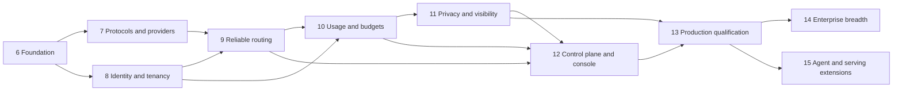

# AI Inference Gateway delivery phases

Updated 2026-09-21. This is the forward implementation plan, not a completion log. **Phase 6 implementation is present with local test evidence; its remaining build/security/remote-CI gates are tracked in [Phase6.md](Phase6.md). Phases 7–15 have not started.** [Roadmap.md](Roadmap.md) preserves actual history. Requirement IDs refer to [PRD.md](PRD.md); technical decisions refer to [Architecture.md](Architecture.md).

## Working approach

The MVP's one-phase-at-a-time rule and fixed library restrictions are retired. Phases now describe dependencies and release gates. Independent work may proceed concurrently once shared contracts are settled; related changes may span phases. There is no requirement to request approval for every routine implementation choice or wait for an entire phase to finish before starting independent work.

Existing architecture and implementation may be changed wherever they are incorrect, difficult to maintain, poorly structured or likely to create unnecessary future complexity. Phase 6 explicitly assesses these issues; later phases can revisit decisions as evidence emerges. Update the design, affected work packages and validation together. Legacy preservation and migration tasks below follow the current transition design and can be revised under the documented redesign policy in Development; tests must validate the accepted replacement behavior rather than enshrine known defects.

Use small vertical slices with an owner, acceptance evidence, compatibility/migration impact and rollback notes. Update relevant docs with meaningful scope/design changes and append a historical milestone only after work is done. No arbitrary dates or delivery durations are assigned without team capacity and pilot workload information. [Development.md](Development.md) describes the lightweight workflow.

## Historical baseline

| Original phase | Recorded result | Status |
|---|---|---|
| 0 | Spring Boot, Compose, entities and V1–V5 migrations | Recorded complete |
| 1 | Request IDs, error model, provider SPI/registry, Ollama and routing | Recorded complete |
| 2 | BCrypt API-key authentication | Recorded complete |
| 3 | Inference endpoint and metadata logging | Recorded complete |
| 4 | Provider/log visibility endpoints | Recorded complete |
| 5 | Log filters, expanded tests and onboarding docs | Recorded complete |

The original 62-test baseline was reproduced before Phase 6 changes. The expanded suite and PostgreSQL checks now pass; [Phase6.md](Phase6.md) records counts, environment, benchmark and remaining gates. None is production certification.

## Dependencies and releases

The graph describes **completion dependencies**. Observability, CI, operations, threat modeling and control-plane schemas start early; they do not wait until their final phase. Phase 10's usage schema can begin after Phase 7's contracts; it cannot close until Phase 9 attempt accounting is integrated. Phase 12's API/schema design can begin in Phase 8, but publication requires privacy and guardrail revisions from Phase 11.

| Release | Required evidence | Exposure |
|---|---|---|
| Private preview | Phases 6–7; legacy tests; streaming/provider contracts | Isolated trusted pilot, no shared tenant service |
| Enterprise beta | Phases 6–10; tenant isolation; real distributed limits and accounting | Controlled pilot with explicit operating limitations |
| GA release candidate | Phases 6–12 plus completed Phase 13 qualification | Staging and customer acceptance |
| Production GA | All F01–F13 gates and Phase 13 evidence signed off | Supported single-region customer-operated product |
| Expansion | Phases 14–15 independently qualified | Only advertised capabilities carry support |

## Phase 6 Foundation and baseline repair

**Status:** Implementation delivered and locally tested; acceptance remains open until every recorded build/scan gate and the clean-checkout CI workflow pass. This is not production readiness. See [Phase6.md](Phase6.md) for reproducible evidence and limitations.

**Goal:** Establish safe, reproducible development and remove known MVP hazards. **Requirements:** F01, foundation of F07/F12. **Dependencies:** existing MVP.

**Work packages**

- Review the MVP's correctness, coupling, responsibility boundaries, testability and operational complexity against upcoming product needs. Record which components to retain, refactor or replace, along with actual API consumers/data dependencies, design rationale and revised acceptance/migration needs. Implement prerequisite improvements within the relevant slices instead of carrying known design problems into new features.
- Reproduce build/test baseline; add Maven wrapper, CI test/build checks, dependency/container/secret scanning and a reproducible release manifest. Inventory versions and upgrade Spring/dependencies to a supported tested baseline.
- Add PostgreSQL-backed tests that execute Flyway; retain fast unit tests. Test fresh V1–V5 install and the next additive migration against a populated MVP database.
- Correct parser/query validation and status mapping: malformed JSON, type mismatch, negative page, zero size, invalid status, reversed time range, oversized body and unsupported media.
- Sanitize public and operational provider errors. Cover routing failures, unexpected transport errors and diagnostic persistence failures in terminal request accounting; define metrics for unauthenticated/validation rejections without unbounded DB writes.
- Add explicit transport and total timeouts, connection-pool/concurrency bounds and cancellation hooks, with retries disabled.
- Deactivate known demo credentials through additive migration/production startup validation; introduce explicit local bootstrap and private management defaults. Do not edit applied V1–V5 checksums.
- Add basic request/outcome/latency metrics and a controllable mock upstream, including delayed and failed responses.
- Record deployment/workload assumptions and the A03 streaming experiment design. Start operational and security checklists.

**Exit evidence**

- CI reproduces a clean checkout build and tests; actual results recorded with command, environment and revision.
- PostgreSQL fresh-install and MVP-upgrade tests pass; production cannot become ready with the known test key.
- Error fixtures show safe 400/401/403/413/415/500/503/504 behavior as appropriate; request IDs survive failures.
- Slow/unreachable upstream tests return within configured bounds; logging failure does not erase the original diagnostic outcome.
- Baseline latency/resource report exists. No new production-readiness claim.

**Migration/rollout:** Additive changes, local profile retains a documented demo path; production startup safeguards intentionally reject unsafe defaults.

## Phase 7 Protocol compatibility and provider foundation

**Goal:** Make the gateway usable with standard client integrations. **Requirements:** F02, F03, F13. **Dependencies:** Phase 6; coordinate principal/tenant contracts with Phase 8.

**Work packages**

- Define immutable command/result/usage/error/context contracts and adapter capabilities.
- Add Chat Completions non-streaming/SSE, text embeddings and model discovery. Keep the legacy inference facade and its response body stable.
- Implement the generic OpenAI-compatible HTTP adapter and adapter factories. Keep native Ollama generation for the legacy path until equivalence is tested; validate Ollama chat/embedding capabilities independently.
- Add direct OpenAI and Anthropic adapters for advertised operations. Anthropic upstream translation does not imply a native inbound Messages endpoint. Never fake unsupported embeddings/tools.
- Add credential references, endpoint allowlists and capability checks before dispatch. Preview may use one explicitly configured isolated tenant context; this is not multi-tenancy.
- Execute A03 spike: bounded async MVC SSE versus a reactive edge, slow clients, cancellation and long streams. Document the chosen transport and executor/connection limits.
- Test tools/structured output only on deployments advertising support; publish a field/feature matrix, SDK versions and error/stream fixtures.
- Add adapter contract tests, mock-only CI, and credential-gated real-provider smoke tests with explicit spend caps and no content artifacts.

**Exit evidence**

- Official Java, Python and Node SDK fixtures pass the advertised subset using gateway URL/key/alias changes.
- Text, tools, usage finalization, fragmented UTF-8/SSE, errors before and after first output, cancellation and slow consumers pass.
- Cancellation releases resources within the proposed measured bound; no duplicate terminal event; unknown usage stays unknown.
- Legacy regression suite passes; unsupported features fail explicitly before upstream dispatch.
- Required adapters each have documented live smoke evidence for advertised capabilities; absent credentials are reported as an open release gate, never marked passed.

**Migration/rollout:** New APIs behind capability flags; preserve legacy routes and default names. Deliver isolated private preview only.

## Phase 8 Identity, administration foundation and tenant isolation

**Goal:** Safely host multiple applications/tenants before exposing shared configuration or spend. **Requirements:** F04; foundation of F09/F10. **Dependencies:** Phase 6, agreed Phase 7 context contract; can progress alongside Phase 7.

**Work packages**

- Add tenants, applications, service accounts, gateway keys, memberships and role bindings. Carry immutable authenticated identity through async work.
- Replace all-key scanning for new keys with indexed public-ID lookup; add one-time reveal, expiry, rotation, revocation and coarse last-used updates.
- Implement admin OIDC validation and scoped permissions; separate admin APIs from inference keys. Secure one-time bootstrap with no fixed admin password.
- Create the minimal audited admin APIs needed for tenant/key/provider lifecycle; all mutations and their audit events commit together.
- Enforce tenant predicates, composite tenant foreign keys and PostgreSQL RLS with a restricted runtime role. Test pooled connections and background workers.
- Migrate legacy records through an explicit legacy tenant mapping; isolate unattributed historical logs. Add key-rotation guide and time-bounded compatibility switch.
- Restrict old logs/providers endpoints by scope and tenant. Add independent revocation/security-epoch propagation and stale-state rejection.

**Exit evidence**

- Two-tenant integration tests cover inference, discovery, log queries, admin resource IDs, service accounts and async context.
- Forged tenant headers, cross-tenant IDs, expired/revoked keys and wrong OIDC issuer/audience cannot bypass checks.
- Inference keys cannot mutate administration; unauthorized mutations do not create changes; audit writes accompany authorized ones.
- Key lookup cost is independent of total key count for new-format keys.
- Fresh/migrated installs pass ownership constraints; security freshness and revocation targets pass across two replicas.

**Migration/rollout:** Backfill before enforcing non-null constraints. Deliberate visibility restrictions and rotation requirements are announced; do not preserve insecure global access for compatibility.

## Phase 9 Virtual models and reliable routing

**Goal:** Route across eligible deployments predictably during normal operation and failure. **Requirements:** F05. **Dependencies:** Phases 7–8.

**Work packages**

- Add deployments, tenant virtual models, capability descriptors, route policies and an initial immutable snapshot loader.
- Implement priority, weighted and ordered fallback pools; add round-robin/least-latency after deterministic selection and stale-sample behavior are tested.
- Implement typed failure classification, total deadlines, jittered retries and Retry-After support. Bound all attempts together; disable hidden client retries.
- Add per-deployment connection isolation, local circuit breakers, bounded probes, recovery jitter and optional shared cooldown hints.
- Reevaluate security eligibility before every attempt; preserve residency, tools, output schema and budgets during fallback.
- Emit request/attempt decision events with configuration version, rejected candidates and selection reasons. Add shadow policy evaluation without upstream duplication.

**Exit evidence**

- Failure matrix in Architecture section 5 passes for connect failure, 429/quota, 5xx, malformed stream, partial output, cancellation and recovery.
- No attempt starts after deadline, cancellation or downstream output; fallback never bypasses tenant/residency/capability policy.
- All providers down yields bounded errors; one broken deployment does not exhaust unrelated connection pools.
- Attempt IDs and potentially charged failures are available to Phase 10; weighted selection and least-latency behavior have meaningful statistical/freshness checks.

**Migration/rollout:** Map old provider/model records to explicit aliases. Canary revised policies by authorized tenant/application, compare outcomes, and retain the previous snapshot.

## Phase 10 Distributed consumption and cost governance

**Goal:** Enforce shared limits and make consumption recoverable and explainable. **Requirements:** F06. **Dependencies:** Phases 8–9 and Phase 7 usage contract.

**Work packages**

- Integrate Redis atomic request/token admission and concurrency leases across applicable tenant/application/key/model scopes.
- Add normalized usage categories, estimate/source markers and immutable price versions; account for cached/reasoning categories without double counting.
- Implement PostgreSQL hard-budget reservations and durable attempt intents; settle actual usage and append corrections. Reserve again before each retry/fallback.
- Add outbox delivery, idempotent workers, alerts/webhook configuration, usage query/export APIs and reconciliation jobs. Test webhook signatures and egress restrictions.
- Keep uncertain crashed/cancelled attempts reserved until audited reconciliation; distinguish cost reporting from external invoice billing.
- Define UTC budget windows, reset boundaries, missing price/usage behavior and Redis/PostgreSQL failure modes.

**Exit evidence**

- At least two replicas enforce the same request limits; token estimation drift is quantified.
- Concurrent reservations cannot oversubscribe any applicable hard budget; failover and process kill do not create free capacity from uncertain spend.
- Duplicate settlement/outbox delivery is idempotent; failed charged attempts appear in spend.
- Unknown price or an unbounded usage model cannot use hard-budget mode silently.
- Export retry/backpressure and dependency-outage tests pass; sample provider usage reconciliation records differences.

**Migration/rollout:** Begin with metering/shadow limits; compare outcomes, then enable enforced policies per tenant. This closes enterprise beta only with all earlier gates satisfied.

## Phase 11 Observability, privacy, guardrails and exact caching

**Goal:** Make the governed gateway diagnosable and safe for sensitive workloads. **Requirements:** F07, F08, F11. **Dependencies:** Phases 8–10; baseline telemetry starts in Phase 6.

**Work packages**

- Complete Micrometer metrics, OpenTelemetry spans, request/attempt search, routing decision views, dashboards, alerts and cardinality limits.
- Implement policy-controlled retention, redacted sampling, optional encrypted content storage and export destinations. Default every sink to content off.
- Add bounded regex/secret detectors, pre/post/stream hooks and adapters for optional external checks. Validate policy capability and fail-open/fail-closed choices.
- Implement opt-in exact caching for eligible non-streaming text/embedding requests with tenant/access partition, versioned keys, TTL/size caps and purge.
- Separate request events, usage events and administrative audit; test access/deletion policies for each.
- Add privacy regression fixtures containing secrets, tool arguments, prompt injection strings and sensitive synthetic data.

**Exit evidence**

- A failed request can be traced from admission through attempts without recording content.
- Synthetic sensitive values do not appear in default DB/log/trace/export artifacts.
- Whole-output policies buffer within caps or reject streaming; chunked checks document limitations and detect their tested cross-chunk patterns.
- Cache entries cannot cross tenant/access partitions; revoked access and changed policies invalidate eligibility.
- Export outages and full queues do not grow memory without bounds; required metering/audit state remains durable.

**Migration/rollout:** Content capture and caching remain disabled until tenant policy opts in. Retention changes include a deletion rehearsal and backups/export treatment.

## Phase 12 Versioned control plane, simulation and console

**Goal:** Let operators administer and understand the product without direct database edits. **Requirements:** F09, F10. **Dependencies:** Phases 8–11; API/schema work can start earlier.

**Work packages**

- Complete admin CRUD for providers/deployments/aliases, policies, budgets, retention and guardrails, using role-scoped services.
- Add schema-versioned declarative import/export, optimistic locking, idempotent mutations and validation.
- Implement draft/validate/stage/activate/rollback, atomic snapshot swap, outbox notifications, polling reconciliation and per-replica acknowledgement.
- Add policy simulation using the live evaluator, synthetic time/health inputs, deterministic seeds and golden fixtures. Mark content-dependent replay checks unevaluated when content is unavailable.
- Build an API-backed console: identity onboarding, provider test connection, model aliases, keys (one-time secret display), budgets/usage, request decisions and configuration diff/rollback.
- Add Java/Python/Node onboarding examples and a Java extension example. Select console framework by team fit and dependency support, not an inherited MVP restriction.
- Complete user-facing errors, accessible navigation, loading/empty/error states, authorization tests and console security.

**Exit evidence**

- Simulate → stage → activate → inspect decision → rollback works without direct DB edits.
- Invalid revisions never reach workers; missed notifications recover via polling; stale workers become unready.
- Concurrent edits return a conflict instead of silently overwriting.
- Console actions match API permissions and audit records; full keys/secrets cannot be recovered after one-time display.
- Rollback retains current revocations and spending. In-flight requests keep their routing revision; emergency disable is independently effective.

**Migration/rollout:** Keep old snapshots until requests drain. Configuration schema changes include compatibility tests; binary rollback is never equated with config rollback.

## Phase 13 Production packaging and release qualification

**Goal:** Demonstrate first GA on a declared operating environment. **Requirements:** F12 and all F01–F13 gates. **Dependencies:** Phases 6–12. Packaging/CI work starts in Phase 6.

**Work packages**

- Produce non-root, pinned/scanned/signed OCI images, SBOMs, checksums and reproducible versioned artifacts.
- Deliver development Compose, production Helm, Linux systemd and Podman Quadlet examples using one documented configuration contract. Package differences and supported OS/runtime versions are explicit.
- Exercise single-region HA, management isolation, TLS/secrets, readiness/liveness, startup migrations, rolling drains, resource requests/limits and capacity planning.
- Build offline installation/upgrade bundles with images/JAR, schemas, migrations, catalogs, signatures and local-model prerequisites.
- Complete on-call runbooks, backup/PITR restore, reservation reconciliation, incident response, key compromise, upgrade and rollback drills.
- Run controlled load/soak, chaos, tenant security, compatibility, config convergence and recovery qualification. Close release findings and publish known limitations.
- Name release, platform, security and operational owners. Set supported version/upgrade policy and distribution/license terms before public artifacts.

**Exit evidence**

- Every item in [Operations.md](Operations.md)'s release evidence checklist has an artifact, tested revision and owner.
- PRD targets are met on the declared reference environment or explicitly revised with evidence before release.
- MVP-to-GA and previous-supported-version upgrade paths pass; backup restore meets the declared RPO/RTO and reconciles uncertain spend.
- A disconnected install with a local provider succeeds without vendor callbacks. Kubernetes and non-Kubernetes packages demonstrate equivalent auth/routing/privacy behavior.
- Staged canary and rollback rehearsals pass; no unresolved critical/high exploitable finding.
- Customer/operator acceptance covers a complete onboarding-to-incident-recovery journey.

**Rollout:** Internal staging → limited pilot/canary → monitored expansion → GA. Promotion is a release decision with concrete evidence; passing unit tests alone is insufficient.

## Phase 14 Enterprise breadth

**Goal:** Expand supported workloads and organization integration without weakening GA semantics. **Requirements:** F14. **Dependencies:** GA contracts; individual spikes may start earlier.

Work includes Bedrock with signed/workload identity access, Azure deployment/auth semantics, native Responses and Anthropic Messages APIs, vision/audio/images/rerank/batch operations by capability, SAML federation through the identity provider, SCIM lifecycle, Vault/cloud secret resolvers, richer audit export and dedicated-tenant deployment options.

Each capability ships independently with wire contracts, privacy/retention implications, charging bounds, adapter conformance, lifecycle/cancellation tests and upgrade documentation. Stateful Responses, files and batch jobs need explicit storage, tenant ownership, idempotency and cleanup design; they are not automatic extensions of synchronous chat. Regional resilience and formal compliance work require separate customer-backed scope.

## Phase 15 Agent governance and inference-aware integrations

**Goal:** Extend a reliable model gateway into governed tool and serving traffic. **Requirements:** F15. **Dependencies:** GA identity, policy, audit and operations.

Work includes an MCP server registry/proxy, tool discovery filtering, principal/tool/resource authorization, credential isolation and approval integration points. Tool invocation is a separate operation family with side effects, not a model retry. Add per-call audit and explicit no-blind-retry defaults. Publish protocol-version conformance and test cancellation/session ownership.

Explore Kubernetes InferencePool/endpoint-picker interoperability through an integration boundary; do not embed a Kubernetes requirement in core inference. Optional prompt registry and evaluation modules use explicit version references and customer-controlled content storage. Semantic caching or quality-aware routing proceeds only after approved privacy rules and a representative evaluation dataset.

Exit evidence includes attempts to bypass tool authorization, SSRF, credential forwarding, cross-tenant sessions and approval/replay controls; serving integration proves policy remains enforced. Optional modules must be disableable without affecting the GA core.

## First implementation backlog

G001–G006 are implemented. G002–G006 have passing local tests; G001's full build/security/remote-CI acceptance follows the open gates in Phase6. G007–G012 are not started. These are issue-sized starting points, not an additional rigid sequence.

| ID | Deliverable | Dependency | Acceptance |
|---|---|---|---|
| G001 | Assess MVP design, reproduce baseline and add build/CI wrapper | MVP | Retain/refactor/replace decisions with rationale and consumer/data impact; clean checkout test/build report; observed failures tracked |
| G002 | PostgreSQL fresh/upgrade migration harness | G001 | V1–V5 plus additive test migration pass on real PostgreSQL |
| G003 | Production bootstrap and seed safeguards | G002 | Demo key rejected before production readiness; local setup documented |
| G004 | Error/validation and lifecycle repair | G001 | Routing, transport, malformed input and log-failure regression fixtures pass |
| G005 | Explicit timeout/concurrency profile | G004 | Slow upstream bounded; retries remain off |
| G006 | Basic telemetry and mock upstream | G001 | Safe request/outcome/latency metrics and controlled failure scenarios |
| G007 | Canonical provider/context/usage contracts | G004 | Legacy mapping and unsupported-capability fixtures agreed |
| G008 | Streaming transport spike and decision | G005–G007 | Slow-client/cancellation measurements; A03 decision recorded |
| G009 | Chat/embedding protocol and generic adapter slice | G007–G008 | Mock-backed wire/SDK fixtures and capability rejections |
| G010 | Tenant/key schema and indexed auth slice | G002–G003, G007 | New key resolves one hash; legacy rotation/backfill tested |
| G011 | OIDC admin roles and transactional audit slice | G010 | Minimal audited tenant/key management; inference key denied |
| G012 | Legacy facade and provider conformance pack | G009–G011 | Existing behavior retained with scoped access; Ollama/cloud smoke gates explicit |

## Decisions, risks and completion tracking

| Decision/risk | Working default | Resolve by |
|---|---|---|
| Team capacity and dates | Dependency plan, no time estimates | Planning implementation iterations |
| Pilot workload and scale | PRD reference target; validate with representative payloads | Phase 6 baseline / beta acceptance |
| Streaming execution model | Bounded async MVC candidate; benchmark reactive alternative | Phase 7 |
| Admin identity provider | Standards-based OIDC, no custom identity server | Phase 8 |
| Retention and residency | Content off; explicit deployment region; conservative sample retention in Operations | Phase 11 / before customer data |
| Provider credentials/test cost | Mock CI; separately budgeted live smoke checks | Phase 7 release gate |
| Usage estimates and missing prices | Unknown state; conservative reservation or deny strict mode | Phase 10 |
| Packaging/support/license | Customer-operated single-region distribution | Phase 13 |
| Broker/microservices | Defer until measured need | Performance evidence, no calendar trigger |

For each completed work package record status, revision, test evidence, migration outcome and known limits in the issue/PR. Update the phase status only after its exit evidence exists. Append milestones in Roadmap without rewriting MVP history.
